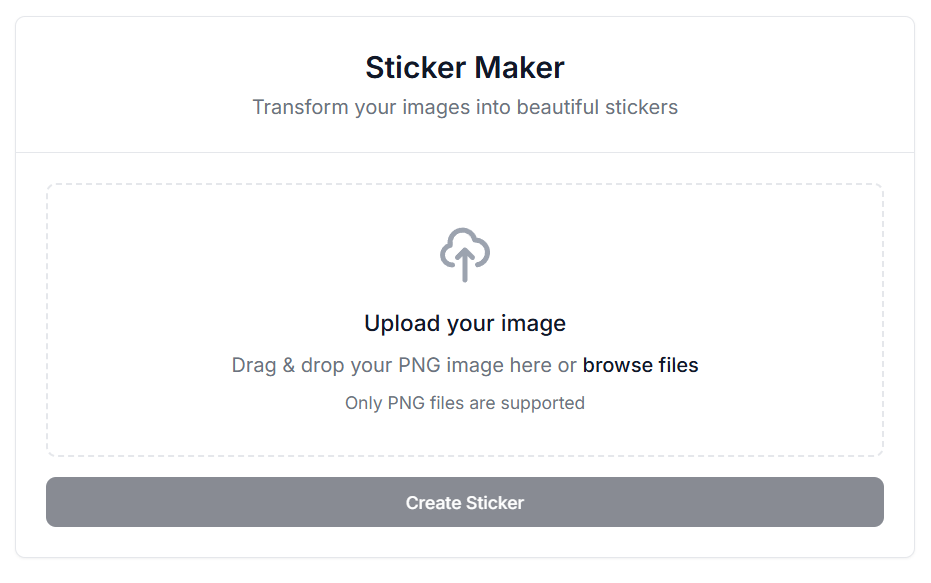
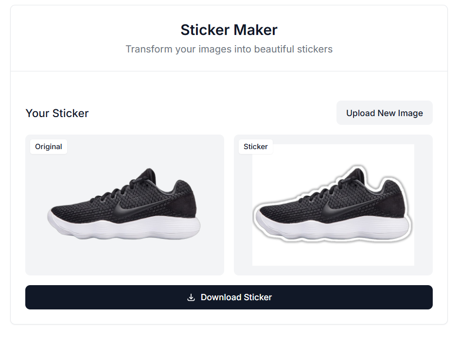

# Python Sticker Maker

Python Sticker Maker is a tool for creating custom stickers from images with options for borders, shadows, and background customization.

## Sample Usage
```python
sticker = StickerMaker(
        alpha_threshold=10,
        border_size=16,
        border_color=(255, 255, 255, 255),
        shadow_size=0,
        shadow_color=(0, 0, 0),
        shadow_transparency=100,
        shadow_blur_strength=10,
        padding=20,
        bg_color=(187, 189, 191, 255),
        bg_transparent=False,
        crop=False
    ).process(
    input_path="images/image3.png", 
    output_path="outputs/image3.png"
)
```


## Image Comparison Table

| Original Image       | Output Image         |
|-----------------------|----------------------|
|  |  |
|  |  |
|  |  |
|  |  |

## API

To use the API, navigate to the `api` folder and run the following command:

```bash
cd api
uvicorn api:app
```

This will start the API server, allowing you to interact with the Sticker Maker tool programmatically.


